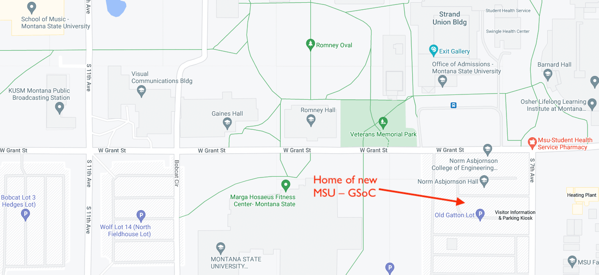

# MSU Gianforte School of Computing

*[TEST]* Montana State University is building a new [Gianforte School of Computing](https://www.cs.montana.edu/). It will be state-of-the-art and world-class. So we're open-sourcing our designs to gather input from around the world.

`Hello, World!` Please read through our Program. Then we hope you'll submit a [New Issue](https://github.com/hearvox/msu-compute/issues) with a  or comment, an  or feature request, a question, or a  report. (There's even a modest Bug Bounty for ideas we use.)

* What would you like to see in a modern school for computing?
* How can we make it both higly functional and fun?
* What features will help attract the best professors?
* How can we seamlessly interact with MSU's other schools, like [Business & Entrepreneurship](https://www.montana.edu/business/index.html),  [Film & Photography](https://sfp.montana.edu/), [Graphic Design](https://art.montana.edu/areas-of-study/graphic-design.html), and the [Engineering](https://coe.montana.edu/) students next door.

*[[Includes](https://github.com/hearvox/msu-compute/tree/main/includes) folder: List Program/Project features, e.g., Code Review/Mini-Prezi hall, Video/audio recording room, Dataviz infographic studio. Each should have its own info file.]*

*[[Assets](https://github.com/hearvox/msu-compute/tree/main/assets) folder: Add architectural drawing and idea sketches.]*

*[[Docs](https://github.com/hearvox/msu-compute/tree/main/docs) folder: Documentation supporting the project scope and timeline.]*

<!--  -->

